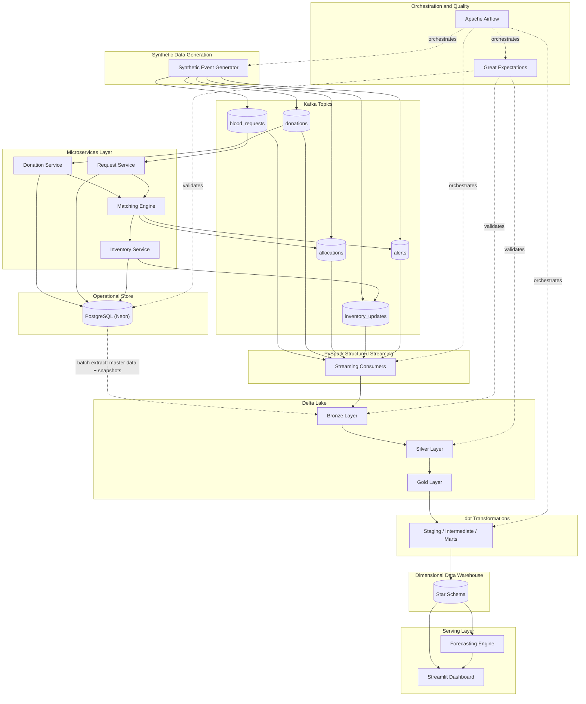
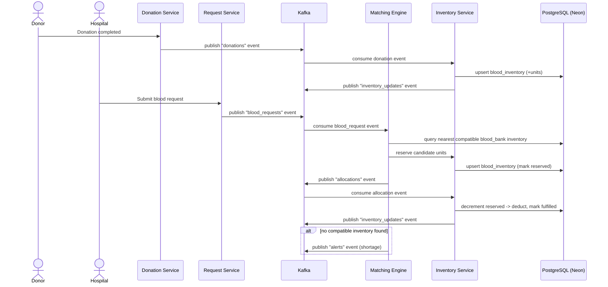
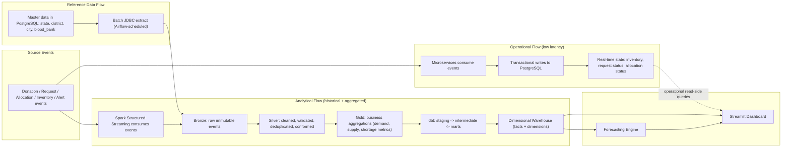
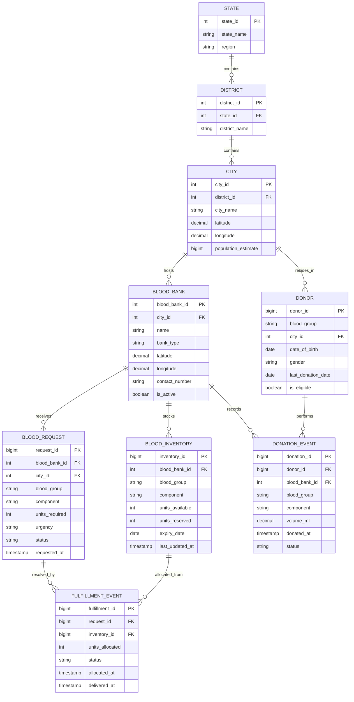
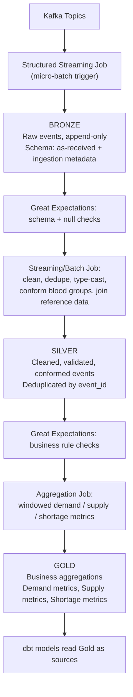
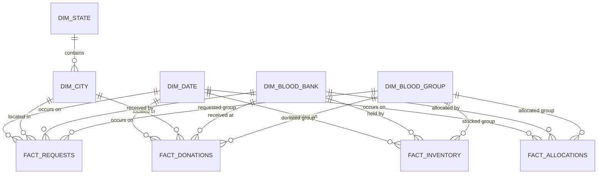
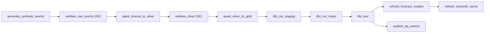
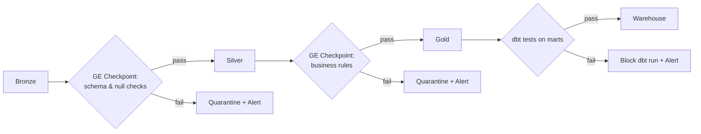
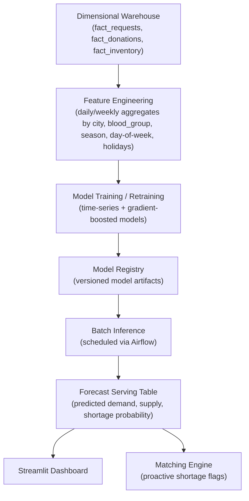
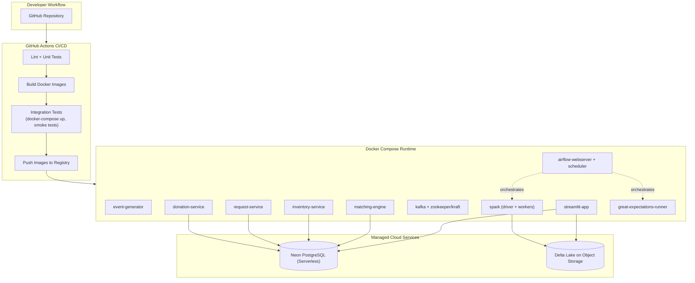

# Blood Availability Intelligence System
## High Level Design (HLD) Document

| | |
|---|---|
| **Project Type** | End-to-End Data Engineering Platform |
| **Domain** | Healthcare / Public Good Simulation — National Blood Ecosystem (India) |
| **Document Version** | 1.0 |
| **Status** | Design Baseline |
| **Audience** | Data Engineering Recruiters, Hiring Managers, Engineers, Technical Interviewers |

> **Note on data:** This platform operates entirely on **synthetic but statistically realistic data**. No real donor, hospital, or patient information is used or stored at any stage. The system is designed and engineered to the same rigor as a production healthcare-data platform, which is the explicit purpose of this project — to demonstrate production-grade data engineering practice on a socially meaningful problem domain.

---

## Table of Contents

1. [Executive Summary](#1-executive-summary)
2. [Business Problem](#2-business-problem)
3. [Functional Requirements](#3-functional-requirements)
4. [Non-Functional Requirements](#4-non-functional-requirements)
5. [High Level Architecture](#5-high-level-architecture)
6. [Component Description](#6-component-description)
7. [Event Driven Architecture](#7-event-driven-architecture)
8. [Data Flow](#8-data-flow)
9. [Kafka Design](#9-kafka-design)
10. [Operational Database Design](#10-operational-database-design)
11. [Lakehouse Architecture](#11-lakehouse-architecture)
12. [Data Warehouse Design](#12-data-warehouse-design)
13. [Airflow Orchestration](#13-airflow-orchestration)
14. [Data Quality Framework](#14-data-quality-framework)
15. [Forecasting Architecture](#15-forecasting-architecture)
16. [Security Considerations](#16-security-considerations)
17. [Scalability Considerations](#17-scalability-considerations)
18. [Deployment Architecture](#18-deployment-architecture)
19. [Technology Decisions and Rationale](#19-technology-decisions-and-rationale)
20. [Future Enhancements](#20-future-enhancements)

---

## 1. Executive Summary

The **Blood Availability Intelligence System (BAIS)** is an end-to-end data engineering platform that simulates a national-scale blood donation and distribution ecosystem for India, and builds the full modern data stack on top of it — from event generation through real-time processing to analytics, forecasting, and dashboards.

Rather than working with a static dataset, BAIS **generates its own world**: donors donate, hospitals raise blood requests, blood banks manage inventory, and a matching engine allocates units to requests — all as a continuous stream of realistic events. This makes the project a faithful proxy for the kind of system a data engineer would build for a real blood-bank network, a logistics company, or any operational business with perishable inventory, geographic dispatch, and real-time supply/demand matching.

The platform is deliberately architected to mirror an industry-grade data platform end to end:

- **Event-driven microservices** (Donation, Request, Inventory, Matching) communicating over **Apache Kafka**
- An **operational system of record** in **PostgreSQL (Neon, serverless Postgres)**
- A **streaming lakehouse** built with **PySpark Structured Streaming** and **Delta Lake** (Bronze → Silver → Gold)
- A **dimensional data warehouse** built with **dbt**
- **Demand and supply forecasting** for proactive shortage detection
- A **Streamlit** dashboard for real-time situational awareness
- **Apache Airflow** for orchestration, **Great Expectations** for data quality, and **Docker + GitHub Actions** for reproducible, automated deployment

The goal of this document is to describe the system at a level of detail suitable for engineering review and technical interviews: what is built, why it is built that way, and how each architectural decision maps to a real-world data engineering concern (consistency, scalability, observability, data quality, and cost).

---

## 2. Business Problem

India's blood supply network is large, geographically distributed, and structurally fragmented. Blood banks operate largely as independent units — hospital-run, NGO-run, or government-run — with **inconsistent inventory visibility across institutions**. This creates a set of recurring, well-documented operational problems that this platform is designed to simulate and solve in miniature:

| Problem | Real-World Consequence |
|---|---|
| **No centralized, real-time inventory view** | A hospital may face a shortage of O-negative blood while a blood bank 10 km away holds surplus units, with neither side aware of the other. |
| **Manual, phone/registry-based matching** | Matching a request to the nearest available compatible unit is slow, error-prone, and not optimized for distance, urgency, or expiry. |
| **Wastage from expiry** | Blood components have strict shelf lives (e.g., platelets ~5 days, red cells ~42 days). Without proactive tracking, usable stock expires unused while shortages exist elsewhere. |
| **Reactive rather than predictive operations** | Shortages are typically discovered *after* a request fails, rather than anticipated from seasonal, regional, and event-driven demand patterns. |
| **Delayed emergency response** | In trauma and surgical emergencies, minutes matter. There is no automated "nearest compatible source" routing comparable to ride-hailing or food-delivery dispatch systems. |
| **Fragmented donor relationship management** | Donor eligibility, donation history, and re-engagement timing are managed locally and inconsistently, reducing voluntary donation conversion. |

**The opportunity this project demonstrates:** these are *data engineering* problems as much as they are healthcare-logistics problems — they require ingesting high-velocity events, maintaining strongly consistent operational state, building a queryable historical analytics layer, and feeding forecasts back into operational decisions. BAIS builds exactly this stack, using a synthetic data generator as a stand-in for real hospital/blood-bank integrations, so that the full pipeline — ingestion, processing, governance, analytics, and prediction — can be demonstrated without dependency on sensitive real-world health data or live institutional partnerships.

---

## 3. Functional Requirements

Functional requirements are organized by the 20 core business capabilities the platform must support.

| FR ID | Capability | Description |
|---|---|---|
| FR-01 | **Blood Availability Search** | Query real-time available units by blood group, component type, city/state, and blood bank. |
| FR-02 | **Blood Allocation Engine** | Given a request, deterministically allocate the best-matching available inventory unit(s). |
| FR-03 | **Real-Time Inventory Management** | Maintain live, consistent inventory counts (available, reserved, expired) per blood bank and blood group. |
| FR-04 | **Donation Event Processing** | Ingest donation completion events and reflect them in inventory within seconds. |
| FR-05 | **Blood Request Event Processing** | Ingest hospital/requestor blood requests and route them into the matching pipeline. |
| FR-06 | **Nearest Blood Bank Recommendation** | Recommend the geographically nearest blood bank(s) holding compatible stock for a given request. |
| FR-07 | **Inventory Reservation System** | Temporarily reserve units against a pending request to prevent double-allocation. |
| FR-08 | **Inventory Expiry Management** | Track expiry dates per unit/batch; flag and remove expired stock automatically. |
| FR-09 | **Blood Shortage Detection** | Detect when available stock for a blood group/region falls below a safety threshold. |
| FR-10 | **Emergency Blood Routing** | For urgent/critical requests, expand search radius and prioritize allocation and routing automatically. |
| FR-11 | **Donor Management** | Maintain donor profiles, eligibility status, donation history, and cooldown periods. |
| FR-12 | **Blood Bank Management** | Maintain blood bank master data: identity, location, capacity, operational status. |
| FR-13 | **Hospital Management** | Maintain requestor (hospital/institution) master data and request history. |
| FR-14 | **Demand Forecasting** | Predict future blood demand by blood group, city, and time horizon. |
| FR-15 | **Supply Forecasting** | Predict future donation supply by blood group, city, and time horizon. |
| FR-16 | **Fulfillment Tracking** | Track a request's lifecycle from allocation through delivery confirmation. |
| FR-17 | **Request Lifecycle Management** | Manage request state transitions: `created → matched → allocated → fulfilled / expired / cancelled`. |
| FR-18 | **Donation Lifecycle Management** | Manage donation state transitions: `scheduled → completed → processed → available → expired/used`. |
| FR-19 | **Geospatial Blood Matching** | Use lat/long-based distance computation to rank candidate blood banks for a request. |
| FR-20 | **State and City Analytics** | Provide aggregated availability, demand, and shortage analytics rolled up by state and city. |

---

## 4. Non-Functional Requirements

| Category | Requirement | Target / Approach |
|---|---|---|
| **Latency** | Operational path (donation/request → inventory update) | p95 < 5 seconds end-to-end (Kafka publish → service consume → Postgres commit) |
| **Latency** | Analytical path (event → queryable in Gold layer) | < 5–10 minutes via micro-batch Structured Streaming triggers |
| **Throughput** | Sustained event ingestion | Designed to comfortably sustain thousands of events/minute across all topics under simulated national-scale load |
| **Availability** | Core services | Each microservice is stateless and horizontally replicable; no single point of failure in the streaming path (Kafka replication, idempotent consumers) |
| **Consistency** | Inventory correctness | Strong consistency in PostgreSQL via transactional reservation/allocation logic; no negative inventory under concurrent allocation |
| **Data Quality** | Validated at every layer boundary | Automated Great Expectations suites gate Bronze→Silver and Silver→Gold promotion |
| **Observability** | Pipeline and infra health | Kafka consumer lag, Spark batch duration, Airflow DAG SLA misses, and data quality pass-rates are all tracked and dashboarded |
| **Reproducibility** | Local and CI environments | Fully containerized via Docker Compose; identical topology in dev, CI, and demo environments |
| **Testability** | CI gating | Unit tests, integration tests, and dbt/GE test suites run automatically on every pull request via GitHub Actions |
| **Maintainability** | Modular design | Clear separation of concerns: ingestion, processing, transformation, storage, and serving are independently deployable modules |
| **Security/Privacy** | PII-equivalent fields | Donor identifiers are synthetic; design includes field-level masking and access-control patterns as if handling real PII |
| **Scalability** | Horizontal scale-out | Kafka partitioning, Spark parallelism, and Delta Lake partitioning all designed to scale with increased simulated load without architectural change |
| **Cost Efficiency** | Serverless-first where possible | Neon Postgres (scale-to-zero), Delta Lake on object storage, and batch-oriented Spark jobs minimize idle compute cost |

---

## 5. High Level Architecture

The platform is organized into five macro-layers: **Generation → Ingestion/Operational → Streaming/Lakehouse → Transformation/Warehouse → Serving**, all coordinated by an **Orchestration & Quality** control plane.



**Two parallel consumption paths off the same Kafka topics** is the central architectural idea:

1. **Operational path** — Microservices consume events to maintain strongly consistent, low-latency state in PostgreSQL (answers "what is true *right now*").
2. **Analytical path** — Spark Structured Streaming independently consumes the same topics into the Bronze Delta layer (answers "what happened over time, and what does it mean").

This avoids coupling the analytical pipeline to the OLTP database (no direct OLTP→Spark reads, no CDC dependency on Postgres internals) while guaranteeing both paths see an identical, ordered event history — a standard pattern in event-sourced systems.

---

## 6. Component Description

| Component | Responsibility | Key Notes |
|---|---|---|
| **Synthetic Event Generator** | Produces statistically realistic donation, request, and inventory events across India's states/cities, blood groups, and urgency levels | Configurable event rate, regional skew, seasonal patterns, and blood-group distribution to mimic real population statistics |
| **Donation Service** | Consumes `donations` events, validates donor eligibility, persists donation records, triggers inventory increment | Owns donation lifecycle state machine |
| **Request Service** | Consumes `blood_requests` events, validates request payload, persists request records, forwards to Matching Engine | Owns request lifecycle state machine |
| **Inventory Service** | Single source of truth for inventory mutation (increment on donation, reserve on match, decrement on allocation, expire on TTL) | All inventory writes are transactional to prevent negative stock |
| **Matching Engine** | Given a request, queries candidate blood banks (geospatial + blood-group compatibility + urgency), ranks them, and issues allocation decisions | Emits `allocations` and, on failure-to-match, `alerts` (shortage) |
| **PostgreSQL (Neon)** | Operational system of record for all master and transactional entities | Serverless Postgres — autoscaling compute, scale-to-zero when idle, branchable for dev/test |
| **Apache Kafka** | Durable, ordered, replayable event backbone decoupling producers from consumers | Topics partitioned for parallelism; consumer groups per service |
| **PySpark Structured Streaming** | Consumes Kafka topics as the entry point into the lakehouse; writes Bronze, drives Bronze→Silver→Gold transformations | Micro-batch (trigger interval) processing model for predictable, testable batches |
| **Delta Lake (Bronze/Silver/Gold)** | ACID-compliant lakehouse storage with schema enforcement, time travel, and efficient upserts (`MERGE`) | Backs both streaming writes and dbt-style batch transformations |
| **dbt** | Declarative, tested, version-controlled SQL transformation of Gold-layer data into the dimensional warehouse | Staging → Intermediate → Marts layering; built-in + custom data tests |
| **Dimensional Data Warehouse** | Star-schema model optimized for BI/analytics queries (facts + dimensions) | Powers the Streamlit dashboard and forecasting feature extraction |
| **Forecasting Engine** | Time-series and ML models producing demand/supply/shortage forecasts | Trained on Gold/warehouse aggregates; outputs land in a forecast serving table |
| **Streamlit Dashboard** | Real-time and historical visualization: availability, shortages, fulfillment, forecasts | Reads from the warehouse and forecast tables; auto-refreshed on a schedule |
| **Apache Airflow** | Orchestrates generation, streaming job lifecycle, dbt runs, data quality checks, dashboard cache refresh | DAG-based scheduling with dependencies, retries, and SLAs |
| **Great Expectations** | Declarative data quality validation at every layer boundary | Fails fast and alerts before bad data propagates downstream |
| **Docker** | Containerizes every service for reproducible local, CI, and demo environments | Single `docker-compose` topology mirrors production service boundaries |
| **GitHub Actions** | CI/CD: lint, unit test, integration test, build, and (optionally) deploy on every push/PR | Also runs scheduled dbt/GE test jobs against a reference environment |

---

## 7. Event Driven Architecture

BAIS is built around **event sourcing principles**: every meaningful state change in the system (a donation, a request, an allocation, an inventory change, an alert) is first published as an immutable event to Kafka, and *all* downstream state — operational and analytical — is derived from that event log. This gives the platform:

- **Decoupling** — producers (the generator, services) never need to know who consumes their events.
- **Replayability** — the Bronze layer and OLTP state can both be rebuilt by replaying the Kafka log (within retention).
- **Auditability** — every business transition has a corresponding event with a timestamp and identity.
- **Extensibility** — new consumers (e.g., a future fraud-detection or notification service) can attach to existing topics without touching existing producers.

### Core event flow



### Idempotency and ordering

- Each event carries a globally unique `event_id` and the relevant business key (`donor_id`, `request_id`, `blood_bank_id`) as the **Kafka message key**, guaranteeing ordered delivery for that entity within a partition.
- Consumers persist `event_id` as part of the write (upsert semantics / unique constraints), so re-delivery (at-least-once Kafka semantics) cannot duplicate business effects.
- Inventory mutation always happens through a single owning service (Inventory Service) reached via Kafka, never via direct cross-service database writes — preventing race conditions across services.

---

## 8. Data Flow

The platform maintains two distinct but synchronized data flows, fed from the same canonical Kafka events.



**Why two flows instead of one?** The operational flow optimizes for *correctness under concurrency and low latency* (single source of truth in Postgres, ACID transactions). The analytical flow optimizes for *historical completeness, cheap storage, and flexible reprocessing* (immutable Bronze, schema-on-write Silver, business-shaped Gold). Trying to serve both needs from one store would compromise one or the other; keeping them separate but fed from the same event log keeps both internally consistent without tight coupling.

---

## 9. Kafka Design

### Topic Catalog

| Topic | Producer(s) | Consumer(s) | Key | Partitions (suggested) | Retention |
|---|---|---|---|---|---|
| `donations` | Synthetic Generator, Donation Service | Donation Service, Spark Streaming | `donor_id` | 6 | 7 days |
| `blood_requests` | Synthetic Generator, Request Service | Request Service, Matching Engine, Spark Streaming | `request_id` | 6 | 7 days |
| `allocations` | Matching Engine | Inventory Service, Spark Streaming | `request_id` | 6 | 7 days |
| `inventory_updates` | Inventory Service | Spark Streaming, Dashboard cache refresher | `blood_bank_id` | 6 | 7 days |
| `alerts` | Matching Engine, Inventory Service | Notification stub, Spark Streaming, Airflow alert sensor | `blood_bank_id` | 3 | 14 days |

### Partitioning Strategy

- Topics keyed by **entity ID that benefits from ordering** (e.g., all events for a given `blood_bank_id` land in the same partition so inventory updates for that bank are strictly ordered).
- Partition count chosen to support horizontal scale-out of consumer groups (one consumer per partition per group) without over-partitioning a moderate-throughput simulation.
- `alerts` uses fewer partitions since volume is intentionally low (alerts are exceptions, not routine traffic).

### Example Event Schemas (JSON)

**`donations` event:**
```json
{
  "event_id": "uuid",
  "event_type": "DONATION_COMPLETED",
  "donor_id": "D10293",
  "blood_bank_id": "BB0451",
  "blood_group": "O+",
  "component": "WHOLE_BLOOD",
  "volume_ml": 350,
  "city_id": "C0091",
  "donated_at": "2026-06-23T08:15:00Z",
  "source": "synthetic-generator"
}
```

**`blood_requests` event:**
```json
{
  "event_id": "uuid",
  "event_type": "REQUEST_CREATED",
  "request_id": "R55821",
  "hospital_id": "H0732",
  "blood_group": "AB-",
  "component": "PLATELETS",
  "units_required": 2,
  "urgency": "CRITICAL",
  "city_id": "C0044",
  "requested_at": "2026-06-23T08:16:30Z"
}
```

**`alerts` event:**
```json
{
  "event_id": "uuid",
  "event_type": "SHORTAGE_DETECTED",
  "blood_bank_id": "BB0091",
  "blood_group": "B-",
  "city_id": "C0017",
  "available_units": 1,
  "safety_threshold": 5,
  "detected_at": "2026-06-23T08:17:00Z"
}
```

### Consumer Group Design

- Each microservice runs its own consumer group (`donation-service-grp`, `request-service-grp`, `matching-engine-grp`, `inventory-service-grp`) so that operational consumption scales independently per service.
- Spark Structured Streaming uses a dedicated consumer group (`spark-bronze-ingest-grp`) entirely separate from operational consumers, so analytical lag never impacts operational throughput, and vice versa.
- **Consumer lag per group** is the primary streaming health metric (see [Monitoring](#monitoring-summary) in Section 17).

---

## 10. Operational Database Design

PostgreSQL (Neon) is the **system of record** for all live operational state. Schema is split into **Master Data** (slowly changing reference data) and **Transactional Data** (high-write operational entities).



### Design Notes

- **Master data** (`state`, `district`, `city`, `blood_bank`) is low-write, high-read reference data — loaded once at simulation bootstrap and updated rarely (e.g., a blood bank's active status). It is the basis for all `dim_*` tables downstream.
- **Transactional data** (`donor`, `donation_event`, `blood_request`, `blood_inventory`, `fulfillment_event`) is high-write and forms the basis of all `fact_*` tables downstream.
- **`blood_inventory`** is the most write-contended table in the system. All mutations go through the Inventory Service inside a single transaction (`SELECT ... FOR UPDATE` style row locking on the relevant `(blood_bank_id, blood_group, component)` row) to guarantee `units_available >= 0` at all times.
- Key indexes: `blood_inventory(blood_bank_id, blood_group, component)`, `blood_request(status, urgency)`, `donor(blood_group, city_id)`, `donation_event(donated_at)` — supporting the most frequent operational queries (availability search, shortage scan, donor eligibility lookup).
- Foreign keys enforce referential integrity (`blood_bank.city_id → city.city_id`, etc.) so **orphan records** are structurally prevented at the OLTP layer, with Great Expectations re-validating this downstream as a defense-in-depth measure.

---

## 11. Lakehouse Architecture

The lakehouse implements the classic **Medallion Architecture** (Bronze → Silver → Gold) on **Delta Lake**, populated by **PySpark Structured Streaming**.



### Layer Definitions

| Layer | Purpose | Characteristics |
|---|---|---|
| **Bronze** | Immutable raw landing zone for every Kafka event, exactly as received | Append-only; partitioned by `event_date` and `topic`; full retention for replay/audit |
| **Silver** | Cleaned, validated, deduplicated, and conformed records | One Delta table per business entity (`silver_donations`, `silver_requests`, `silver_allocations`, `silver_inventory_updates`); `MERGE`-based upserts keyed on `event_id` / business key; blood group values normalized (e.g., `"o positive"` → `O+`); joined with reference data (state/district/city/blood_bank) for enrichment |
| **Gold** | Business-level aggregates, ready for consumption | Pre-aggregated **demand metrics** (requests by group/city/time), **supply metrics** (donations by group/city/time), and **shortage metrics** (available vs. safety threshold by blood bank/group) — windowed (hourly/daily) for trend analysis |

### Why Delta Lake

- **ACID `MERGE`** enables correct upsert/deduplication semantics on a streaming source without rewriting whole partitions.
- **Schema enforcement and evolution** catches malformed synthetic-generator output before it silently corrupts Silver.
- **Time travel** allows Great Expectations failures or pipeline bugs to be diagnosed against a previous table version, and supports safe backfills.
- **`OPTIMIZE` + Z-ORDER** on (`blood_bank_id`, `blood_group`, `event_date`) keeps Gold-layer aggregation queries fast as data volume grows.

---

## 12. Data Warehouse Design

The Gold layer is further modeled by **dbt** into a **star schema** dimensional warehouse, optimized for BI-style querying from Streamlit and feature extraction for forecasting.



### Dimensions

| Table | Type | Notes |
|---|---|---|
| `dim_date` | Standard date dimension | Day, week, month, quarter, year, is_weekend, fiscal attributes — supports seasonal demand analysis |
| `dim_state` | Conformed reference dimension | State name, region |
| `dim_city` | Conformed reference dimension | City name, state reference, lat/long, population bucket |
| `dim_blood_bank` | **SCD Type 2** | Tracks history of `is_active` status and capacity changes over time |
| `dim_blood_group` | Static reference dimension | 8 standard blood groups, with compatibility/cross-match rules as attributes |

### Facts

| Table | Grain | Key Measures |
|---|---|---|
| `fact_requests` | One row per blood request | `units_required`, `urgency`, `fulfillment_status`, `time_to_fulfillment` |
| `fact_donations` | One row per completed donation | `volume_ml`, `units_donated` |
| `fact_inventory` | One row per blood bank / blood group / component / snapshot date | `units_available`, `units_reserved`, `days_to_expiry` |
| `fact_allocations` | One row per allocation decision | `units_allocated`, `distance_km`, `allocation_latency_seconds` |

### dbt Model Layering

```
models/
├── staging/        -- 1:1 with Gold sources, light renaming/typing (stg_donations, stg_requests, ...)
├── intermediate/    -- business logic: fulfillment status derivation, distance calc, expiry flags
└── marts/
    ├── core/         -- dim_* and fact_* models described above
    └── analytics/    -- pre-joined, denormalized marts for Streamlit (e.g., shortage_by_city_today)
```

- All dimension and fact models are tested with dbt's built-in (`not_null`, `unique`, `relationships`, `accepted_values`) and custom tests (e.g., `assert_no_negative_inventory`).
- Incremental materialization is used for high-volume fact tables (`fact_requests`, `fact_donations`, `fact_allocations`) to keep daily dbt runs fast as history accumulates.

---

## 13. Airflow Orchestration

Airflow is the control plane coordinating every batch/scheduled aspect of the platform.

| Responsibility | DAG | Schedule | Key Tasks |
|---|---|---|---|
| **Event Generation Orchestration** | `dag_event_generation` | Continuous (short interval, e.g., every 1–5 min) | Trigger/health-check the synthetic generator process |
| **Spark Job Scheduling** | `dag_lakehouse_pipeline` | Every 10–15 min | Bronze ingest, Silver transform, Gold aggregation, post-write GE validation |
| **dbt Model Execution** | `dag_dbt_transform` | Hourly (or after `dag_lakehouse_pipeline` success) | `dbt run --select staging`, `dbt run --select marts`, `dbt test` |
| **Data Quality Validation** | Embedded as gating tasks within the above DAGs | Per-run | Great Expectations checkpoints; DAG fails fast on critical rule violation |
| **Dashboard Refresh** | `dag_dashboard_refresh` | Every 5–10 min | Refresh Streamlit's cached query layer / materialized analytics marts |
| **Forecast Retraining** | `dag_forecast_retrain` | Daily | Retrain/refresh demand & supply forecast models, write to forecast serving table |

### DAG Dependency Graph



### Operational Practices

- Each task has **retries with exponential backoff** and a defined **SLA**; SLA misses raise an `alerts`-style notification.
- Cross-DAG dependencies use **Airflow Datasets/Sensors** so `dag_dbt_transform` only triggers once `dag_lakehouse_pipeline` has produced fresh Gold data, avoiding fixed-offset scheduling guesswork.
- All DAGs are idempotent — safe to re-run for a given logical date without duplicating downstream effects (Delta `MERGE`, dbt incremental logic).

---

## 14. Data Quality Framework

Data quality is enforced with **Great Expectations (GE)** at every critical layer boundary, not just at the end of the pipeline — so bad data is caught as close to its source as possible.

| Rule | Layer Enforced | GE Expectation Type (representative) |
|---|---|---|
| **No negative inventory** | Postgres (constraint) + Silver/Gold (GE) | `expect_column_values_to_be_between(units_available, min_value=0)` |
| **Valid blood groups** | Bronze→Silver | `expect_column_values_to_be_in_set(blood_group, ["A+","A-","B+","B-","AB+","AB-","O+","O-"])` |
| **No orphan records** | Silver (post-join with reference data) | `expect_column_values_to_not_be_null(blood_bank_id)` after join; custom referential-integrity check against `dim_blood_bank` |
| **Duplicate request detection** | Bronze→Silver | `expect_column_values_to_be_unique(event_id)`; custom check for duplicate `request_id` within a short time window |
| **Inventory consistency validation** | Silver/Gold reconciliation | Custom expectation reconciling `sum(units_allocated)` against `sum(units_donated) - sum(units_available) - sum(units_expired)` per blood bank/group |

### Quality Gating Strategy



- **Quarantine, don't drop:** records failing validation are written to a quarantine table/path with the failure reason attached, rather than silently discarded — preserving auditability and enabling reprocessing after a fix.
- **Fail fast, alert immediately:** a failed checkpoint fails the owning Airflow task, which is configured to publish an `alerts`-equivalent notification rather than letting downstream tasks run on unvalidated data.
- **Metrics, not just pass/fail:** GE validation results (pass rate, row counts, specific failing expectations) are persisted over time so data quality trend — not just a single run's outcome — is observable on the monitoring dashboard.

---

## 15. Forecasting Architecture

The forecasting layer consumes **Gold-layer / warehouse aggregates** (not raw events) as its feature source, since forecasting operates on time-bucketed signal, not individual transactions.



### Forecasting Use Cases and Approach

| Use Case | Approach | Output |
|---|---|---|
| **Blood demand prediction** | Time-series forecasting (e.g., seasonal-decomposition / gradient-boosted regression on engineered calendar + lag features) per `(city, blood_group)` | Predicted request volume, next N days |
| **Blood shortage prediction** | Classification model combining forecasted demand vs. forecasted supply vs. current inventory trajectory | Shortage risk score per `(blood_bank, blood_group, day)` |
| **Seasonal demand analysis** | Decomposition of historical demand into trend/seasonal/residual components (e.g., festival periods, summer accident spikes) | Seasonality profile feeding both dashboards and model features |
| **City-wise demand forecasting** | Same modeling approach as demand prediction, sliced and rolled up by `dim_city` / `dim_state` | City-level and state-level forecast tables for the analytics dashboard |

### Design Principles

- **Backtesting-first:** every model is evaluated on a rolling-origin backtest (train on history up to T, evaluate on T+1..T+N) before being promoted, mirroring real deployment risk.
- **Reproducible retraining:** the entire training pipeline runs as an Airflow task against versioned warehouse snapshots, so any forecast can be traced back to the exact data and model version that produced it.
- **Feedback loop:** shortage forecasts feed back into the Matching Engine's evaluation context (e.g., expanding emergency search radius proactively for blood groups already flagged as high shortage-risk) — closing the loop from analytics back into the operational system.

---

## 16. Security Considerations

Although BAIS uses entirely synthetic data, it is **designed as if** it handled real PII and protected health information, to demonstrate production-appropriate practice:

| Concern | Approach |
|---|---|
| **Sensitive field handling** | Donor identifiers, contact info, and exact location are treated as PII-equivalent: masked/tokenized in any layer exposed to the dashboard, never displayed in plaintext below the city level |
| **Secrets management** | Database connection strings, Kafka credentials, and API keys are never hard-coded; injected via environment variables / GitHub Actions encrypted secrets, with `.env` files git-ignored |
| **Network isolation** | In Docker Compose, services communicate over an internal Docker network; only the Streamlit app and Airflow UI expose ports externally |
| **Database access control** | Neon Postgres roles are scoped per consumer (read-only role for the dashboard/reporting path, read-write role limited to the owning microservice) following least-privilege |
| **Kafka access control** | Topic-level ACLs restrict which service principals may produce/consume each topic (e.g., only Matching Engine may produce to `allocations`) |
| **Data minimization** | Only fields required for matching/analytics are retained in Silver/Gold; raw Bronze retention is time-bounded rather than indefinite |
| **Audit trail** | Every state-changing event is immutably logged in Kafka/Bronze, providing a complete, replayable audit trail of "who changed what, when" |
| **CI/CD security** | GitHub Actions workflows pin dependency versions, run dependency/secret scanning, and never echo secrets into logs |
| **Synthetic-data boundary** | The generator is the *only* data source; no live ingestion path from real hospital/donor systems exists, eliminating real-world PHI exposure risk entirely |

---

## 17. Scalability Considerations

| Layer | Bottleneck Risk | Scaling Strategy |
|---|---|---|
| **Synthetic Generator** | Single-process event throughput ceiling | Parallelize generation by region/shard; multiple generator processes producing to the same partitioned topics |
| **Kafka** | Partition count limits consumer parallelism | Increase partitions per topic as load grows; partition key chosen so increasing partition count doesn't break ordering guarantees needed per entity |
| **Microservices** | Stateless, but bound by Postgres write throughput | Horizontally replicate each service behind its consumer group; connection pooling (PgBouncer-style) to Neon |
| **PostgreSQL (Neon)** | Hot-row contention on `blood_inventory` | Fine-grained row-level locking scoped to `(blood_bank_id, blood_group, component)`; Neon autoscaling compute; read replicas for reporting-style queries |
| **Spark Structured Streaming** | Micro-batch processing time exceeding trigger interval | Tune trigger interval and executor parallelism; partition Delta tables by `event_date`/`blood_bank_id` to bound shuffle/scan size |
| **Delta Lake** | Small-file proliferation from frequent micro-batch writes | Scheduled `OPTIMIZE` + `VACUUM`; Z-ORDER on high-cardinality filter columns |
| **dbt / Warehouse** | Full-refresh runs become slow as history grows | Incremental materializations on fact tables; partition pruning on `dim_date` joins |
| **Forecasting** | Retraining cost grows with city × blood-group combinations | Batch/vectorized training across grouping keys; retrain cadence decoupled from inference cadence |
| **Streamlit Dashboard** | Re-querying the warehouse on every page load | Pre-aggregated analytics marts (`marts/analytics`) refreshed by Airflow; dashboard reads cached results, not raw fact tables |
| **Airflow** | Single scheduler becoming a throughput bottleneck | Use CeleryExecutor/KubernetesExecutor topology to parallelize task execution across workers |

### Monitoring Summary

| Signal | What It Tells You |
|---|---|
| **Kafka consumer lag** (per consumer group/topic) | Whether a downstream consumer is falling behind producers — the earliest signal of a processing bottleneck |
| **Pipeline health** (Airflow DAG success rate, task duration trend, SLA misses) | Whether scheduled batch/streaming jobs are completing reliably and on time |
| **Data quality metrics** (GE pass rate per checkpoint, row counts, quarantine volume) | Whether incoming/transformed data is trustworthy before it reaches analytics or forecasting |
| **Processing latency** (event timestamp → Bronze write timestamp → Gold write timestamp) | End-to-end freshness of the analytical layer, surfaced directly on the dashboard |

---

## 18. Deployment Architecture



### Environment Strategy

| Environment | Purpose | Notes |
|---|---|---|
| **Local Dev** | Developer iteration | Full stack via a single `docker-compose up`; Neon dev branch for an isolated, disposable database |
| **CI (GitHub Actions)** | Automated verification on every PR | Spins up the same Compose topology; runs unit, integration, dbt, and GE test suites; tears down after the run |
| **Demo/Showcase** | Recruiter/interviewer-facing environment | Long-running deployment of the same containers with the generator tuned to a steady, presentable event rate, and Streamlit publicly reachable |

### CI/CD Pipeline Stages

1. **Lint & static analysis** — Python (ruff/flake8), SQL (sqlfluff for dbt models)
2. **Unit tests** — per microservice and per transformation function
3. **Build** — Docker images per service, tagged with commit SHA
4. **Integration tests** — bring up the full Compose stack in CI, run an end-to-end smoke test (publish a synthetic donation → assert inventory updates → publish a request → assert allocation)
5. **dbt + Great Expectations test suite** — run against a CI-scoped Neon branch
6. **Publish** — push validated images to a container registry; tag the release

---

## 19. Technology Decisions and Rationale

| Technology | Why Chosen | Alternatives Considered |
|---|---|---|
| **Python** | Single language across generators, microservices, Spark (PySpark), Airflow DAGs, and Streamlit — minimizes context-switching and maximizes library reuse (Faker, geo libraries, ML libraries) | Go (better raw throughput per service, but fragments the stack and slows iteration speed for a project of this scope) |
| **PostgreSQL (Neon)** | Full relational/ACID guarantees needed for inventory correctness; Neon's serverless model (scale-to-zero, branchable databases) keeps a demo project cheap to run and gives CI a disposable database-per-PR pattern | Self-hosted Postgres (more ops overhead); DynamoDB/NoSQL (weaker fit for relational integrity and ad-hoc joins needed for matching) |
| **Apache Kafka** | Industry-standard durable, ordered, replayable event log; mature ecosystem and the clearest way to demonstrate event-driven architecture skills | AWS SQS/SNS (simpler, but weaker ordering/replay semantics and less representative of large-scale event-driven systems) |
| **PySpark Structured Streaming** | Unifies streaming and batch semantics under one engine; directly integrates with Kafka and Delta Lake; widely used in industry for exactly this Bronze/Silver/Gold pattern | Apache Flink (excellent for streaming, but a second JVM-heavy ecosystem alongside Spark, adding complexity without a clear benefit at this scale) |
| **Delta Lake** | ACID `MERGE`/upserts on streaming data, schema enforcement, and time travel are essential for a reliable medallion architecture | Plain Parquet (no transactional guarantees, no safe concurrent writes); Apache Iceberg/Hudi (comparable feature set, but Delta has the tightest native integration with Spark Structured Streaming) |
| **dbt** | Declarative, version-controlled, testable SQL transformations with a strong convention for staging/marts layering — the de facto standard for warehouse modeling | Hand-rolled SQL/Python transformation scripts (harder to test, document, and maintain consistently) |
| **Streamlit** | Fastest path from a Python-based analytics layer to an interactive, shareable dashboard — ideal for a portfolio/demo context | Power BI/Tableau (better for enterprise BI, but introduces a non-Python, less portfolio-transparent tool); Dash (comparable, but Streamlit's simplicity wins for this scope) |
| **Docker** | Reproducible, portable definition of every service's runtime environment; identical topology across dev/CI/demo | Bare-metal/venv-only setup (fragile, environment-drift-prone) |
| **GitHub Actions** | Tight integration with the GitHub-hosted repository; no separate CI infrastructure to manage | Jenkins (more powerful, but unnecessary operational overhead for this project's scope) |
| **Great Expectations** | Purpose-built, declarative data quality framework with native support for checkpoints, quarantine patterns, and rich validation result history | Custom assertion scripts (less standardized, harder to extend and report on) |
| **Git** | Version control for every artifact — code, dbt models, Airflow DAGs, GE suites, infrastructure config — as a single source of truth | N/A — non-negotiable baseline for any engineering project |

---

## 20. Future Enhancements

| Enhancement | Description |
|---|---|
| **Live data source integration** | Replace/augment the synthetic generator with read-only, anonymized feeds from real (consenting) blood bank partners, behind the same Kafka contract |
| **Change Data Capture (CDC) from Postgres** | Introduce Debezium-style CDC as an alternative/complementary path for master-data propagation, replacing scheduled batch JDBC extracts |
| **ML-ranked matching** | Replace rule-based distance/urgency ranking in the Matching Engine with a learned ranking model incorporating historical fulfillment success and traffic/transport time |
| **Mobile donor app integration** | Push-based donor notifications (eligibility reminders, nearby shortage alerts) via a companion mobile app, sourced from the same `alerts` topic |
| **Real-time alerting channels** | Route `alerts` events to SMS/WhatsApp/Email via a notification microservice for on-call blood bank staff |
| **Kubernetes migration** | Move from Docker Compose to a Kubernetes deployment (Helm charts) for production-grade autoscaling, rolling deploys, and multi-node Spark execution |
| **Multi-region simulation** | Extend the generator and matching logic to model cross-state blood transport logistics and inter-state shortage balancing |
| **GraphQL API layer** | Expose availability search, allocation, and analytics as a typed GraphQL API for third-party (hospital system) integration |
| **Online/streaming forecasting** | Move from scheduled batch retraining toward incremental/online learning for faster reaction to emerging shortage patterns |
| **Blockchain-based donation provenance** | Explore an immutable provenance ledger for donation-to-transfusion traceability as an academic/showcase extension |
| **Data contracts** | Formalize Kafka event schemas with a schema registry (e.g., Avro + Confluent Schema Registry) and enforce compatibility checks in CI |

---

*End of High Level Design Document — Blood Availability Intelligence System*